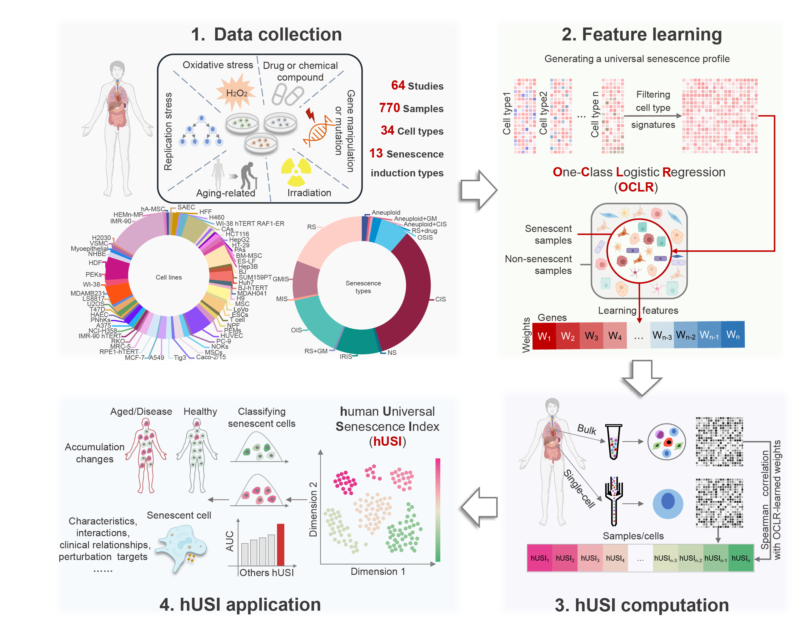
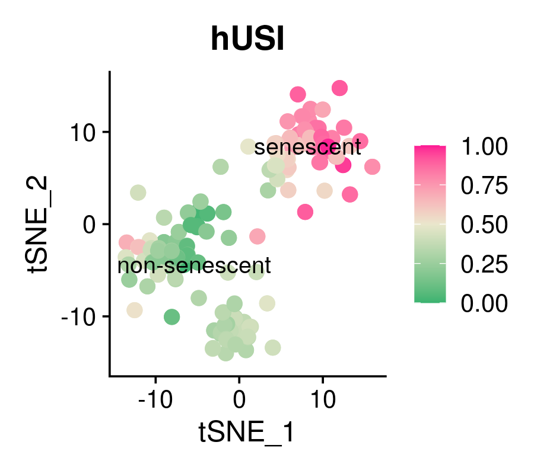
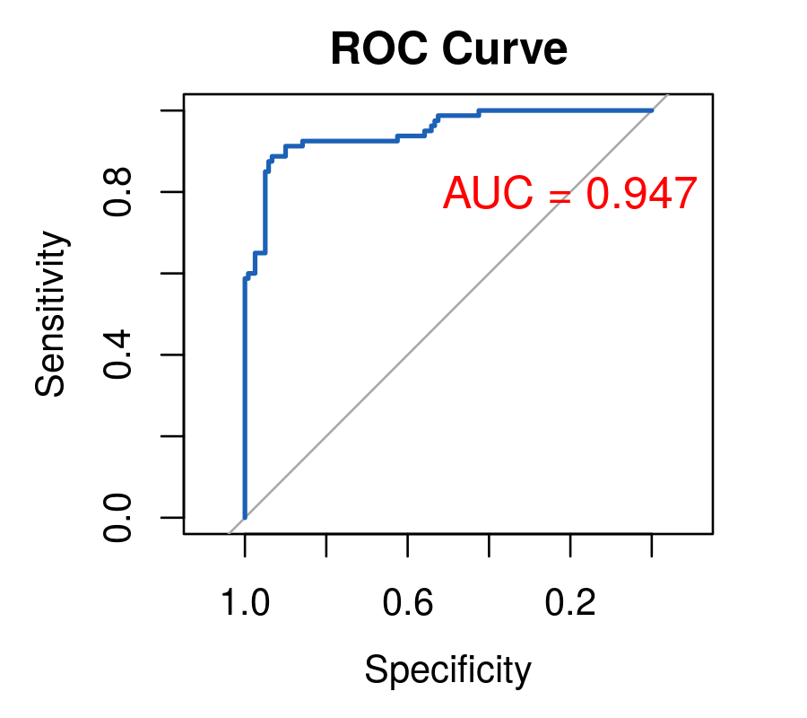

## Using hUSI to evaluate senescence state and reveal novel senescence regulators

#### We introduced the human universal senescence index (hUSI) into the evaluation of senescence based on transcriptome profiles to identify senescent cells/samples across different cell types, conditions and sequencing platforms. Senescence features were learned from the comprehensive senescence transcriptome profiles (bulk RNA-seq data) utilizing a One-Class Logistic Regression (OCLR) model. The scoring for each sample or cell is determined using the Spearman correlation coefficient. Senescence status can be further classified through Sum of Squares for Error (SSE) or Gaussian Mixture Model (GMM).
## Note
We recommend two methods based on different assumptions:  
(1) If assuming that there are only **two cell states**, senescence and non-senescence, in the dataset, we used a **variance-based method—sum of square error (SSE)**—for thresholding. SSE, as the **well-performed binary clustering method** for one dimension vector, can divide cells into senescence and non-senescence group by minimizing the variance of hUSI of two groups.  
(2) If assuming there are **uncertain senescence states** in the dataset, we use **Gaussian Mixture Model (GMM)** to estimate the optimal number of senescence states and the probability that each cell belongs to a specific state. Since GMM is frequently used as **optimal thresholding tool** in various scenarios, it is helpful to determine cellular senescence heterogeneity.
#### All scriptis for reproducing results in the manuascripts can be found in `HUSI/R` folder. All raw data used for model trianning and validation can be found in `HUSI/Data` folder. All figures in paper can be found in `HUSI/Results` folder.
## Usage
#### Make sure you have already clone the `HUSI` repository by `git clone git@github.com:WJPina/HUSI.git` or downloaded the zip file.
#### Run in R (make sure packages below have been installed)
`R==4.0.5 Seurat==4.2.1 mclust==6.0.1 dplyr==1.1.4 ggplot2==3.5.0 pROC==1.18.0`
```R
source('sc/hUSI.R')
### exp: input normalized gene expression matrix 
library(Seurat)
load('Data/Aarts2017.rdata')
exp = GetAssayData(Aarts2017)
hUSI = cal_hUSI(exp)

### visualization using Seurat
library(ggplot2)
Aarts2017$hUSI = hUSI
# Aarts2017 = NormalizeData(Aarts2017) # Aarts2017 has already normalized 
Aarts2017 <- FindVariableFeatures(Aarts2017) %>% ScaleData() %>% RunPCA() %>% RunTSNE(dims=1:15)
Idents(Aarts2017) <- 'Condition'
png('R_demo_hUSI.png',width=900,height=800,res=250)
FeaturePlot(Aarts2017,features='hUSI',label=T,pt.size=3)+
scale_color_gradient2(low ='#3AB370' ,mid = "#EAE7CC",high = "#FD1593",midpoint = 0.5)
dev.off()

### exibite accurancy of hUSI
library(pROC)
roc_obj <- roc(Aarts2017$Condition, Aarts2017$hUSI, levels=c('non-senescent', 'senescent'), direction='<')
auc_value <- auc(roc_obj)
png('R_demo_ROC.png',width=900,height=800,res=250)
plot(roc_obj, main="ROC Curve", col="#1c61b6")
text(x=0.2, y=0.8, labels=paste("AUC =", round(auc_value, 3)), cex=1.2, col="red")
dev.off()

### classify senescent group by SSE
SenClass = SSE_hUSI(hUSI)
### classify senescent group by GMM
SenClass = GMM_hUSI(hUSI)
```
R_demo_hUSI            |  R_demo_ROC
:-------------------------:|:-------------------------:
 |  

#### Run in Python (make sure modules below have been installed)
`python==3.9.18 pandas==2.1.4 numpy==1.26.3 rpy2==3.5.16 matplotlib==3.8.2`
```python
from sc.hUSI import cal_hUSI,SSE_hUSI,GMM_hUSI
### adata: input annadata formant with normalized gene expression matrix included as X
import scanpy as sc
import matplotlib.colors as clr
adata = sc.read_h5ad('Data/Aarts2017.h5ad')
### make sure library packages in classifier.py and mclust in R have been installed
hUSI = cal_hUSI(adata)

### we add a new function enabaling calculating hUSI parallelly in large scale dataset.
# from sc.hUSI import cal_hUSI_parallel
# hUSI = cal_hUSI_parallel(adata,n_jobs=20)

### visualization using Scanpy
adata.obs['hUSI'] = hUSI
# sc.pp.normalize_total(adata) # Aarts2017 has already normalized 
# sc.pp.log1p(adata) # Aarts2017 has already normalized 
sc.pp.highly_variable_genes(adata,n_top_genes=2000)
adata.raw = adata.copy()
adata = adata[:,adata.var.highly_variable]
sc.pp.pca(adata,n_comps=15)
sc.pp.neighbors(adata)
sc.tl.tsne(adata)
color_self = clr.LinearSegmentedColormap.from_list('pink_grey', ['#3AB370',"#EAE7CC","#FD1593"], N=256)
sc.pl.tsne(adata,color='hUSI',save='Python_demo_hUSI.png',size=30,cmap = color_self)

### classify senescent group by SSE
SenClass = SSE_hUSI(hUSI)
### classify senescent group by GMM
SenClass = GMM_hUSI(hUSI)
```
#### Citation (please make this paper citated when applying hUSI for publication)
Wang, J., Zhou, X., Yu, P. et al. A transcriptome-based human universal senescence index (hUSI) robustly predicts cellular senescence under various conditions. Nat Aging (2025). https://doi.org/10.1038/s43587-025-00886-2

