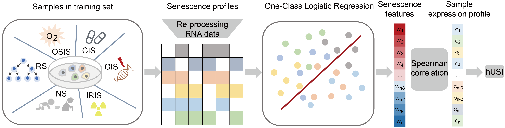

# Using hUSI to quantify senescence degree for human RNA-seq data

# hUSI
### We introduced the human universal senescence index (hUSI) into the quantification of senescence based on transcriptome profiles to identify senescent cells and categorize senescent subpopulations across different cell types. Senescence features were learned from comprehensive transcriptome profiles utilizing a One-Class Logistic Regression (OCLR) model. The scoring for each sample or cell is determined using the Spearman correlation coefficient. Senescence status can be further classified through the Gaussian Mixture Model (GMM).
#### `RNA-seq_PE/SE.snakemake` : Processing pipeline of paired end or single end RNA-seq data in training set.
#### `Train.R` : Processing training set and trainning the model.
#### `Valid.R` : Validating performance of hUSI in independent datasets.
#### `Compare.R` : Comparing performance of hUSI wit other three types of senescence quantification methods.
#### `Melanoma.R` : Processing and analyzing melanoma scRNA-seq dataset.
#### `COVID-19.ipynb` : Processing and analyzing COVID-19 snRNA-seq dataset.
# Usage

